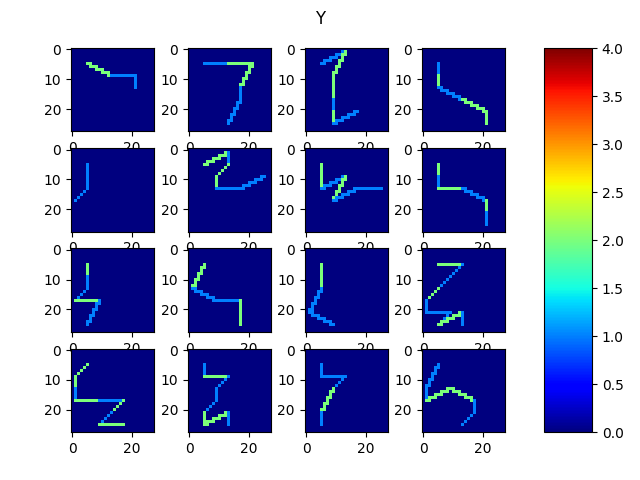

ne_ne : neural networks pour les presque nuls
============================================

Ce projet contient:
 * des modèles élémentaires en tensorflow. 
 * des données générées ultra-simpliste. 
 
 Les modèles s'ajuste (se 'fit') sur les données en quelques minutes avec un ordinateur ordinaire.
 Cette phase d'apprentissage est faite en parallèle avec des validations. A la fin, on fait un test. 
 Les données d'apprentissage sont toujours différentes des données de test/validation. 
 
 
 TODO : 
 * des exemples avec des données plus conséquentes
 * utiliser le bas de VGG plutôt que celui de LeNet
  
 
 
  [THE BASIC EXAMPLE](ne_ne/THE_BASIC_EXAMPLE.py)  
  --------------------------------------
  
  Il s'agit d'un modèle linéaire avec une pénalisation L2 (on l'appelle aussi modèle ridge): 
  
  > Y_hat = a X + b  
  > loss = (Y-Y_hat)^2 +  cst*a^2
 
 
 Ce "BASIC-EXAMPLE" permet de voir la structure typique 
 que j'utilise toujours : le modèle est codé dans un objet ayant des méthodes
 * fit(X_train,Y_train)
 * evaluate(X_val,Y_val)
 * predict(X_test)
 
 
 Ce qu'on peut aussi apprendre dans ce fichier:
 * comment utiliser tensorboard : un outil de visualisation propre à tensorflow. On y affiche notamment les gradients
 * comment sauver et restaurer un modèle. 
 * comment changer les hyper-paramètres durant l'apprentissage : le learning_rate, la pénalisation L^2  
 
 
 Les données générée sont des points alignées selon une équation y =ax+b. 
 L'apprentissage de 'a' et 'b' est immédiat. Nous affichons la courbe
 de loss pour voir l'effet du changement des hyper-paramètres. 
 
 
 
 
 
 
 
[Classification multi/mono labels](ne_ne/TasteExample/A_multi_vs_mono_labels.py)
----------------------------------------------------

C'est le convNet de Yann Le Cun. On l'appelle parfois "LeNet". Il est composé de (seulement) deux couches de
convolution et de deux couches denses (fully connected).    

> INPUT ---> \[CONV ---> RELU ---> POOL  \] *2 --->  FC ---> RELU ---> FC

Ensuite dans le cas mono-label, on produit un vecteur probabilité
>   ---> solfmax ---> OUTPUT

Dans le cas multi-label on produit un vecteur donc chaque composante est une probabilité:
>   --->  sigmoid ---> OUTPUT

Les données sont 
* des disques ou des carrées dans le cas mono-label
* des disques et/ou des carrés ou rien pour le multi-label

La fonction loss est la cross-entropie. 
Attention : la formule de cette loss n'est pas la même en mono ou multi-label

[Bounding box](ne_ne/TasteExample/B_bounding_box.py)
---------------------------------------------

Il s'agit de reconnaître des disques ou des carrés, mais aussi de les localiser avec
des bounding box.  Volontairement les bounding box ne sont pas 
paramétrées de la même façon pour les disques ou les carrés. Cela oblige le modèle à d'abord
reconnaître la classe avant d'estimer la bounding box. 

On reprend le bas de LeNet: 

> INPUT ---> \[CONV ---> RELU ---> POOL  \] *2

Puis on y branche en parallèle : 
* le haut de LetNet pour la classification
* une multiplication matricielle pour régresser les paramètres de la bounding box.

[fully convolutional](ne_ne/TasteExample/C_fullyConv.py)
--------------------------------------------------

Le modèle va devoir inférer une image :
* Quand l'entrée sera un rectangle, il devra marquer le contour
* quand l'entrée sera un disque, il devra marquer le centre

On part toujours de LeNet-bottom  
> INPUT ---> \[CONV ---> RELU ---> POOL  \] *2

On y branche deux couches de convolutions 1*1

Puis commencent des up-convolutions. Ces opérations augmentent la taille des images. 
On en met deux couches pour retrouver la résolution initiale. 

Voici les résultats obtenus avec un learning rate de 1e-3, avec 1000 itérations.
On voit qu'on a des problèmes sur les bords. Mais sinon c'est OK. 

[inférence sur des lignes](ne_ne/TasteExample/D_learningLines.py)
--------------------------------------------------

Le modèle est le même que précédemment. On repère :

* Des segments, en estimant leur orientation (4 classes d'orientations)

 

  

* Des lignes brisées, en estimant leur épaisseurs (2 classes d'épaisseurs)

 

  

* Des lignes brisées en repérant leur cassures.
Cela marche moins bien. Ci-dessous nous affichons les probabilités des 3 catégories :

- cat 1 :  demi-tours, en particulier le début et la fin de la ligne
- cat 2 :  proche d'un angle droit
- cat 3 :  proche d'un angle plat = tous les autres points de la ligne  

 
 

 
 

 

